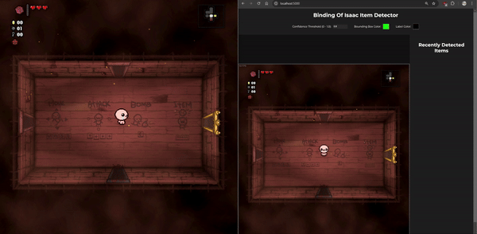
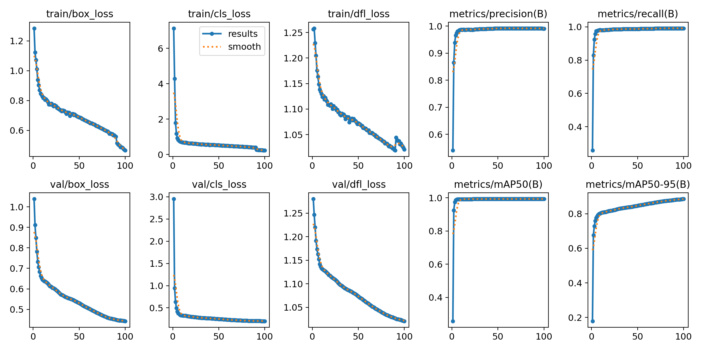

# Binding of Isaac Item Classifier 
Ever played the Binding of Isaac and didn't know what a new item does? Feel like installing the item descriptions mod is too easy of a solution? This project is for you!



# Prerequisites
- This system is (unfortunately) only supported on Windows, due to the way the game window is obtained using the Win32 API
- You'll also need a copy of the Binding of Isaac (all DLC up to Repentance is recommended, that's what I used)
- The web app was only tested using Google Chrome as the browser but the frontend doesn't using any tricks, so any modern browser should work

# Usage
### 1. Clone the repository to your desired location
Run this in your desired folder in the terminal: `git clone https://github.com/khan0617/Realtime-Binding-of-Isaac-Item-Detector.git`


### 2. Create a [conda](https://conda.io/projects/conda/en/latest/user-guide/install/index.html) environment to install the dependencies in
1. Create the conda environment, run this in the anaconda prompt: `conda create -n "isaac_item_recognizer" python=3.11.9`
2. Activate the environment: `conda activate isaac_item_recognizer`
    - You can verify it's activated by running `conda env list`, a `*` should be next to the env we just made
    - All actions going forward assume your conda environment is being used to run these commands

### 3. Install Project Dependencies
Run either command in the root of the project, an example path is provided below (only run the command to the right of the `>`):
1. recommended: `C:\<your-clone-path-here>\realtime-binding-of-isaac-item-detector> pip install -e .`
2. alternative: `C:\<your-clone-path-here>\realtime-binding-of-isaac-item-detector> pip install -r requirements.txt`

### 4. Run the system
This github repo comes packaged with the trained model weights, so no need to run training on your own.
Make sure you have your Isaac.exe game running *before* launching the system.

1. Launch the Binding of Isaac game by any means (likely going to Steam and clicking "Play")
2. In your terminal, from the project root, launch the flask web app: 
```
C:\<your-clone-path-here>\realtime-binding-of-isaac-item-detector> python ./src/isaac_web_app/app.py
```
3. Navigate to `http://localhost:5000` on your browser and enjoy!

# Documentation
Sphinx generated docs available here: https://khan0617.github.io/Realtime-Binding-of-Isaac-Item-Detector/. The code is also well-documented; every function should have a docstring.

# Data
The `data/` directory contains web-scraped `.png` files for each and every item in the Binding of Isaac (up to and including Repentance) aside from *Tonsil*, which was removed in Repentance. No trinkets, cards, or pills are included.

- `data/items/`: All item images are in this folder. Organization is like: `data/items/<item_id_tail>/original_img.png`, where `<item_id_tail>` is the end of the item ID. 
    - For example, on the [wiki for Guppy's Head](https://bindingofisaacrebirth.fandom.com/wiki/Guppy%27s_Head), the entity ID is "5.100.145". So to get the image for Guppy's Head, go to `data/items/145/original_img.png`.

- `data/isaac_backgrounds/`: I manually downloaded various backgrounds from the [Isaac Wiki's Gallery](https://bindingofisaacrebirth.fandom.com/wiki/Rooms?file=Binding_Of_Octorock.jpg#Gallery), then resized them to a size of (1000 width, 625 height). The images are available in this `data/isaac_backgrounds/` directory.
    - I picked these images to represent a variety of floors and rooms across the game
    - As a note, I did have to convert some of these images from `.webp` to `.jpg` format.

## Data Augmentation
I created a data augmentation system in [data_augmentor.py](./src/image_processing/data_augmentor.py) where, for an item image, you can supply a list of augmentations to apply to it. For example, noise, contrast adjustment, rotation, among others (see [augmentation.py](./src/image_processing/augmentation.py) for all augmentations). These augmented item images are ultimately randomly overlaid on each Isaac background from `data/isaac_backgrounds`. 

Transformations can be composed of sets of augmentations to apply to an image, serially. I wrote this before I found out about [PyTorch's Compose module](https://pytorch.org/vision/main/generated/torchvision.transforms.Compose.html) 😔

The final dataset used for training ended up having 94332 training images, 11791 validation images, and 11793 test images, for an 80-10-10 train-val-test split.

# Training
I selected a YOLOv8 model from Ultralytics and trained it for 100 epochs across the data. Each epoch took about 20 minutes, it was a bit over 30 hours of training on an RTX 4090 GPU over multiple sessions, not all at once.

You can see the per-epoch losses below as training progressed:



# Results
I have not formally tested the performance of the model on the live game, just visually inspected it. The model generally works well, but for things it hasn't seen before, including certain enemies, floors, tear effects etc. the model gets confused and may see those as items. This is why I added a Confidence Threshold control on the UI to tune this and hopefully filter out bad recognitions.

As an example, the model sees Isaac's base tears as either "unicorn stump" or "lump of coal" items relatively often, so I had to add an edge-case check for that.

This is likely just a symptom of the dataset not being varied enough. I didn't use any images with tears or enemies, or even any other characters than Isaac, so the model was not able to learn. This is despite applying all those augmentations and random placements on each background.

# Performance
Regarding the actual performance of the system, it's unfortunately not as "realtime" as I would've hoped -- perhaps it's some combination of using screenshots from mss as my image source to the model, using python for image processing, or just sending the inference results to the client over a socket (despite using `socket-io` to try to remedy this).

If the game is running at 60fps on your PC, then the streamed video feed to the web app feels more like 15-20 fps at best. This is an area of improvement I could look into.

# Learnings
This project helped me learn the following technologies and techniques:
- Webscraping with [beautifulsoup](https://www.crummy.com/software/BeautifulSoup/bs4/doc/)
- Image dataset generation and augmentation using [Pillow](https://python-pillow.org/) and [NumPy](https://numpy.org/)
- Training a YOLO model (used [Ultralytics](https://docs.ultralytics.com/) yolo) for object detection and running inference for bounding box detection.
- Screenshotting windows using [mss](https://python-mss.readthedocs.io/) in python
- Accessing the Windows32 API in Python to get the Isaac game window with [pygetwindow](https://github.com/asweigart/PyGetWindow)
- [Flask-SocketIO](https://flask-socketio.readthedocs.io/en/latest/) for communication with the frontend from the Flask webapp
- Git [pre-commit](https://pre-commit.com/) hooks
- Code formatting and linting in Python with [isort](https://pycqa.github.io/isort/), [black](https://github.com/psf/black), and [pylint](https://www.pylint.org/)
- Unit testing with [pytest](https://docs.pytest.org/en/stable/)
- Python packaging and configuration, specifically using [pyproject.toml](https://packaging.python.org/en/latest/guides/writing-pyproject-toml/)
- Generating docs using [sphinx](https://www.sphinx-doc.org/en/master/)